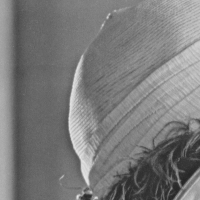

# Mean Filter

The implement of image crop using pure C.

## Parameter of Algorithm

* **Anchor Point=(50, 50)**
* **Cropped size=200x200**

## Input

**Name: lena_gray.raw**  
**image size=512x512**  
  

## Result

**Name: lena_gray_Cropped_W200H200.bmp**  
**image size=200x200**  
  
